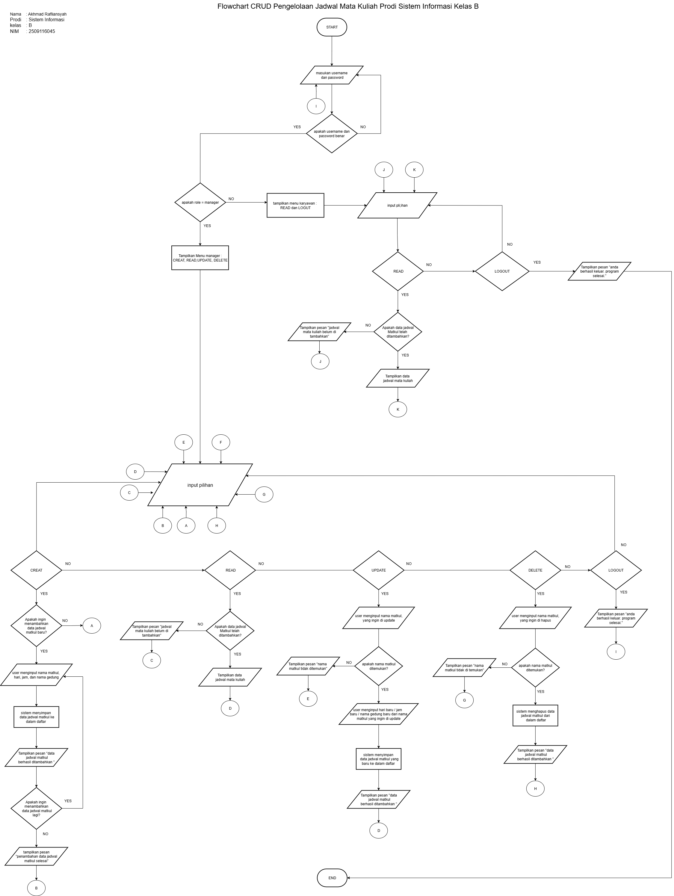
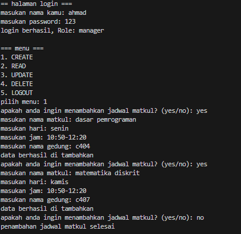
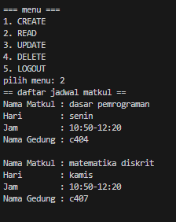
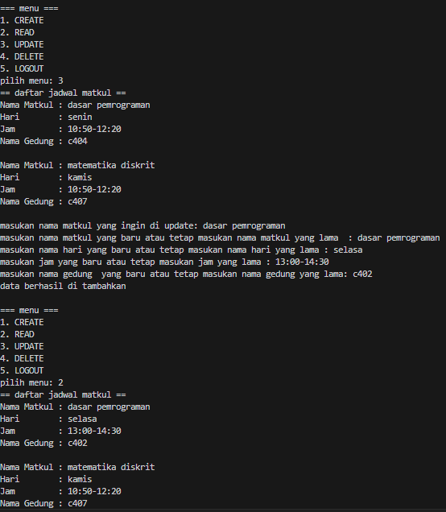
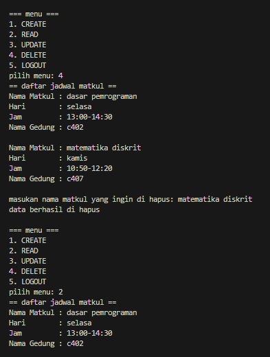
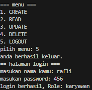
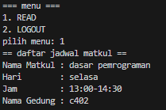
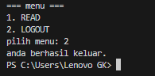

## Mini Project DDP 2
## Tema  : Pengelolaan Jadwal Matkul Prodi Sistem Informasi Kelas B
## Nama  : Akhmad Rafliansyah
## prodi : Sistem Informasi
## kelas : B
## NIM   : 2509116045

**penjelasan flowchart:**
1. Program di mulai dari **start**
2. user akan login dengan memasukan username dan password
3. jika username dan password salah maka user harus memasukan username dan password sampai benar. jika sudah benar maka user akan masuk role manager atau karyawan tergantung dari username dan pasword yang dimasukan
4. jika user masuk role manager maka akan di tampilkan menu khusus role manager yaitu **CREAT**, **READ**, **UPDATE**, **DELETE**, dan  **LOGOUT**.
5. Jika user memilih **CREAT** maka akan ada 2 pilihan yaitu ingin menambahkan data baru atau tidak. jika user memilih tidak maka user akan langsung menuju menu utama lagi. jika user memilih ingin menambahkan data baru maka user harus menginput **nama matkul, hari, jam, dan nama gedung**. setelah itu sistem akan menyimpan data ke dalam daftar dan akan mendapatkan pesan yaitu **"data berhasil di tambahkan"**. alur berlanjut user akan mendapatkan dua pilihan lagi yaitu ingin menambahkan data lagi atau tidak. jika user memilih ingin menambahkan data lagi maka user akan kembali menginput data. jika user memilih tidak maka akan mendapatkan pesan **"penambahan data jadwal matkul selesai"**. selanjutnya user kembali menuju menu utama.
5. jika user memilih **READ** maka akan ada pertanyaan **"Apakah data jadwal Matkul telah ditambahkan?"**. jika data jadwal matkul belum ditambahkan maka user akan mendapatkan pesan **"jadwal matkul belum ditambahkan"** dan user akan langsung menuju menu utama. jika data jadwal matkul sudah  ditambahkan maka sistem akan menampilkan daftar jadwal matkul yang sudah di tambahkan. selanjutnya user akan kembali menuju menu utama.
6. jika user memilih **UPDATE** user akan menginput nama matkul yang ingin di update. jika nama matkul tidak ada maka user akan mendapatkan pesan **"nama matkul tidak ditemukan"** dan user akan langsung menuju menu utama, jika nama matkul ada, maka user akan mengupdate data dari matkul tersebut yaitu harinya, jamnya, dan nama gedungnya. ketika sudah, sistem akan menyimpan data matkul yang di update ke dalam daftar lalu user akan mendapatkan pesan **"data jadwal matkul berhasil ditambahkan"** dan user akan langsung menuju menu utama.
7. jika user memilih **DELETE** user akan menginput nama matkul yang ingin di hapus. jika nama matkul tidak ada maka user akan mendapatkan pesan **"nama matkul tidak ditemukan"** dan user akan langsung menuju menu utama, jika nama matkul ada, sistem akan menghapus data matkul dari dalam daftar lalu user akan mendapatkan pesan **"data jadwal matkul berhasil dihapus"** dan user akan langsung menuju menu utama
8. jika user memilih **LOGOUT** maka user akan mendapatkan pesan **"anda berhasil keluar"** dan program akan langsung menuju login.
9. karena tadi user berada di role manager maka selanjutnya user akan login di role karyawan.
10. Di menu karyawan user akan di tampilkan menu khusus karyawan yaitu **READ** dan **LOGOUT**.
11. jika user memilih **READ** maka akan ada pertanyaan **"Apakah data jadwal Matkul telah ditambahkan?"**. jika data jadwal matkul belum ditambahkan maka user akan mendapatkan pesan **"jadwal matkul belum ditambahkan"** dan user akan langsung menuju menu utama. jika data jadwal matkul sudah  ditambahkan maka sistem akan menampilkan daftar jadwal matkul yang sudah di tambahkan. selanjutnya user akan kembali menuju menu utama.
12. jika user memilih **LOGOUT** maka user akan mendapatkan pesan **"anda berhasil keluar, program selesai"** dan program akan langsung berhenti/**END**.

**penjelasan output pada terminal program pytho dengan memperlihatkan semua kondisi:**

**1. Halaman login, menu khusus role manager, dan menu CREAT**

 
 
 - Di halaman login user memasukan username dan password untuk login sebagai manager atau karyawan dengan ketentuan **"Username : ahmad, password : 123" (role = manager)**, **"Username : rafli, password : 456" (role = karyawan)**. jika user tidak memasukan username dan password dengan ketentuan login tersebut maka user tidak bisa masuk kedalam program sampai user benar memasukan username dan password untuk role manager atau karyawan. Di screenshot tersebut pertama saya masuk di login sebagai role manager.
 - karena login sebagai role manager maka program akan memberikan lima pilihan menu khusus role manager yaitu **CREATE**, **READ**, **UPDATE**, **DELETE**, **LOGOUT**.
 - Pertama saya memilih role manager dengan mengetik angka **"1"** dan bisa juga mengetik **"CREAT"**., maka program akan menjalankan menu **"CREATE"** yang merupakan menu untuk menambahkan jadwal matkul, pertama program akan menampilkan pertanyaan **"apakah anda ingin menambahkan jadwal matkul? (yes/no)"**. di situ saya mengetik **yes** untuk menambahkan jadwal matkul dengan mengisi **nama matkul**, **hari**, **jam**, **nama gedung**. jika sudah maka program akan bertanya lagi **"apakah anda ingin menambahkan jadwal matkul? (yes/no)"** distu saya jawab **yes** lagi dan di pertanyaan ketiga saya jawab **no** untuk berhenti menambahkan jadwal matkul ke dalam daftar. user harus menjawab **yes/no** karena jika tidak program akan terus memberikan pertanyaan tersebut. karena sudah jawab**no** maka program akan langsung kembali ke menu utama.

**2. Menu READ**

 

 - Selanjutnya saya mengetik angka **"2"** atau bisa juga **"READ"** untuk menampilkan daftar jadwal matkul yang sudah saya tambahkan sebelumnya, bisa di lihat di situ ada dua daftar jadwal matkul lengkap dengan **nama matkulnya, hari, jam, nama gedung**. jika sebelumnya saya tidak menambahkan jadwal matkul apapun maka di menu **READ** ini daftar jadwal matkul tidak ada atau kosong dan hanya menampilkan pesan **"daftar jadwal matkul masih kosong"**. selanjutnya program akan langsung kembali ke menu utama.

 **3. Menu UPDATE**
 

- selanjutnya saya mengetik angka **"3"** atau bisa juga **"UPDATE"** untuk merubah atau merevisi jadwal matkul. pertama program akan menampilkan daftar jadwal matkul dan program akan memerintahkan untuk memasukan nama matkul yang ingin di **UPDATE**, jika sudah program akan mengecek apakah nama matkul tersebut ada di dalam daftar, jika tidak ada maka program akan menampilkan pesan **"data nama jadwal matkul tersebut tidak di temukan"** dan program akan langsung kembali ke menu utama. jika nama matkul tersebut ada di dalam daftar, maka user bisa mengubah atau merevisi data dari jadwal nama matkul tersebut, mulai dari **nama matkul, hari, jam, dan nama gedungnya** jika sudah merubah atau merevisi di bagian **nama gedung** maka program akan mengupdate data dari jadwal nama matkul tersebut dan akan menampilkan pesan **"data berhasil di tambahkan"**. selanjutnya program akan langsung kembali menuju menu utama.
- Di menu utama lagi saya mengetik angka **"2"** atau bisa juga **"READ"** untuk melihat data dari jadwal matkul yang sudah di ubah tadi. bisa di lihat data dari jadwal matkul dasar pemrograman berubah. selanjutnya program akan langsung kembali menuju menu utama.

**4. Menu DELETE**

- selanjutnya saya mengetik angka **"4"** atau bisa juga **"delete"** untuk menghapus bebrapa jadwal matkul dari dalam daftar. pertama program akan menampilkan daftar jadwal matkul dan program akan memerintahkan untuk memasukan nama matkul yang ingin di hapus, jika sudah, program akan mengecek apakah nama matkul tersebut ada di dalam daftar, jika tidak ada maka program akan menampilkan pesan **"data nama jadwal matkul tersebut tidak di temukan"** dan program akan langsung kembali ke menu utama. jika nama matkul tersebut ada di dalam daftar, maka program akan menghapus data jadwal matkul tersebut dari dalam daftar. lalu program akan menampilkan pesan **"data jadwal matkul tersebut berhasil di hapus"**. selanjutnya program akan langsung kembali menuju menu utama.
- Di menu utama lagi saya mengetik angka **"2"** atau bisa juga **"READ"** untuk melihat data dari jadwal matkul yang saya hapus tadi. bisa di lihat data dari jadwal matematika sudah tidak ada di dalam daftar. selanjutnya program akan langsung kembali menuju menu utama.

**5. Menu Logout dan halaman login role karyawan**

- Menu **LOGOUT** adalah menu untuk keluar atau mengakhiri program dari menu khusus role manager dimana program akan menampilkan pesan **"anda berhasil keluar"** dan akan langsung kembali ke halaman login.
- Karena tadi sudah login di role manager selanjutnya saya login di role karyawan.

**6. Menu READ**

  

  - di menu role karyawan ini hanya ada dua yaitu **READ** dan **LOGOUT**. pertama saya mengetik angka **"1"** atau bisa juga **"READ"** untuk menampilkan daftar jadwal matkul yang sudah saya tambahkan sebelumnya di role manager, bisa di lihat di situ hanya ada satu daftar jadwal matkul lengkap dengan **nama matkulnya, hari, jam, nama gedung**. jika sebelumnya di role manager saya tidak menambahkan jadwal matkul apapun maka di menu **READ** ini daftar jadwal matkul tidak ada atau kosong dan hanya menampilkan pesan **"daftar jadwal matkul masih kosong"**. selanjutnya program akan langsung kembali ke menu utama.

**7. Menu LOGOUT**

- Di menu yang kedua ini saya mengetik angka **"2"** atau bisa juga **"LOGOUT"** untuk keluar atau mengakhiri seluruh program dan program akan menampilkan pesan **"anda berhasil keluar"**.

  

 
 
 
